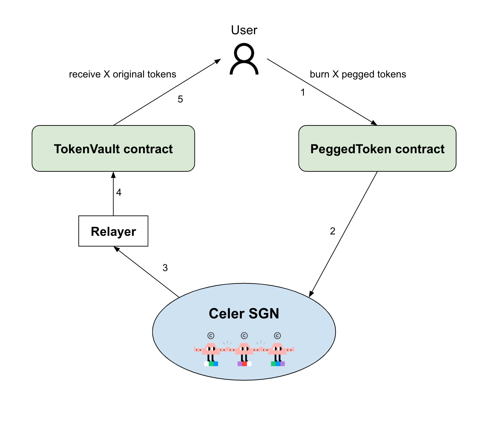

# Fungible Token Bridging Models

Celer cBridge supports two fungible token bridging models:

* **xAsset, the canonical mapping bridge:** This model is intended for a token that needs to be bridged from its original source chain, chain A, to a new chain, chain B, when it has not yet been deployed on chain B. Celer cBridge will create a mapped version of the token on chain B via a lock-and-mint model.\
  \
  When a user transfers the token from chain A to chain B, the original tokens will be locked on chain A and an equal number of tokens will be minted in a 1:1 pegged ratio and sent to the user on chain B. Reversely, when a user transfers tokens from chain B to chain A, the pegged tokens will be burned on chain B and an equal number of tokens will be sent back to the user on chain A.\
  \
  **Please Note:** In [xAsset v2,](https://blog.celer.network/2022/06/02/celer-cbridge-launches-xasset-v2-to-support-omni-directional-cross-chain-transfers-for-bridged-tokens/) in addition to bridging between the original source chain and the specific canonically mapped destination chain, tokens can also be bridged between different canonical mapping chains in a mint-and-burn method without routing back to the original chain. This way there is only one copy of the canonically mapped token on all of the supported canonical mapping chains.\

* **xLiquidity, the pool-based bridge.** This model is intended for a token that has been deployed on different chains and does not conform to the [cBridge standard](https://github.com/celer-network/sgn-v2-contracts/blob/main/contracts/pegged-bridge/tokens/MintSwapCanonicalToken.sol). Liquidity pools will be created on the various chains to support bridging. When users transfer between these chains they will be depositing their tokens into the pool on the source chain and withdrawing a matching number of tokens from the pool on the destination chain based on a bridge rate generated by the [StableSwap pricing curve](https://classic.curve.fi/files/stableswap-paper.pdf).

## xAsset Architecture

Suppose token T has been deployed on chain A but not yet on chain B. If bridging is needed for the token T between chain A and chain B, then two contracts need to be deployed:&#x20;

* **TokenVault** contract. This contract is deployed on chain A. The user can deposit token T into this vault and receive pegged tokens on chain B, or withdraw token T from the vault if pegged tokens are burned on chain B.
* **PeggedToken** contract which mints or burns the pegged tokens on chain B.

**Transfer from chain A to chain B (Lock-and-Mint Flow)**

The below figure illustrates the steps for bridging token T from chain A to chain B.

1. User deposits X number of token T to the TokenVault contract on chain A.
2. The Celer State Guardian Network (SGN) monitors the deposit event. Upon receiving the deposit event, the SGN generates a multisig that grants minting X pegged tokens on chain B.
3. The relayer fetches the SGN’s multisig.
4. On chain B, the relayer calls the PeggedToken contract with the multisig.
5. The PeggedToken contract mints X tokens to the user on chain B.

**Transfer from chain B to chain A (Burn-and-Release Flow)**

The below figure illustrates the steps for bridging the pegged tokens from chain B back to chain A.

1. User calls PeggedToken contract to burn X pegged tokens on chain B.
2. The Celer SGN monitors the burn event. Upon receiving the burn event, the SGN generates a multisig that grants the withdrawal from the TokenVault contract on chain A.
3. The relayer fetches the SGN’s multisig.
4. On chain A, the relayer calls the TokenVault contract with the multisig.
5. The TokenVault contract sends back X number of token T to the user.

### xAsset Fee Structure

The fee for a token bridged in the xAsset model is calculated as such: \
Fee = Base Fee + Protocol Fee

The **Base Fee** is paid in the form of the tokens being transferred, and covers the destination-chain gas cost for sending the tokens to the user.

The **Protocol Fee** is proportional to the transfer amount, and is paid to State Guardian Network (SGN) validators and stakers in return for their services. The **Protocol Fee** ranges from 0% to 0.5% of the total transfer amount.

### xLiquidity Fee Structure

The fee for a token bridged in the xLiquidity model is calculated as: \
Fee = Base Fee + Protocol Fee

The **Base Fee** is paid in the form of the tokens being transferred, and covers the destination-chain gas cost for sending the tokens to the user.

The **Protocol Fee** is proportional to the transfer amount (after a bridge rate conversion), and is paid to cBridge liquidity providers and State Guardian Network (SGN) validators and stakers in return for their services. The **Protocol Fee** ranges from 0% to 0.5% of the total transfer amount.

