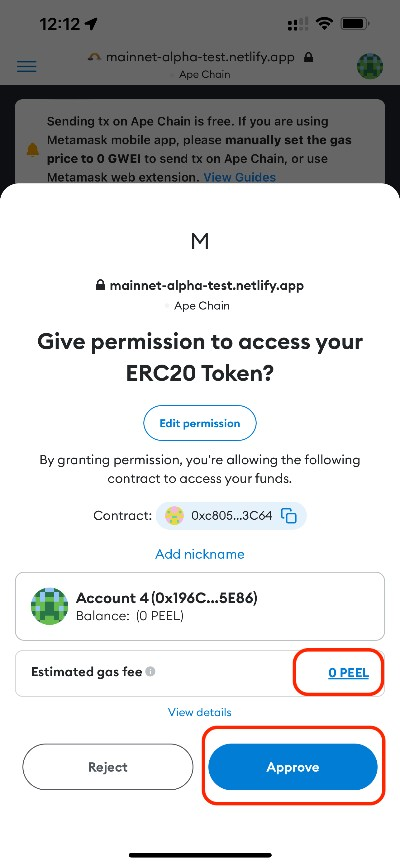

# Ape Chain Bridging Guide

Sending bridge transactions on Ape Chain is currently free. However, if you are using mobile wallets (e.g., Metamask mobile, imToken), you may be asked to pay gas fees (in $PEEL) when submitting tx on Ape Chain. In this case, please follow the below guides to solve the issues.

### Metamask Mobile App

If you are using Metamask mobile app, you may be asked to pay gas fees when approving NFTs or SHELL tokens on Ape Chain.

In this case, click on the gas fee link as highlighted above, and you will see the popup to adjust the gas price.

Change the gas price from 1 GWEI to 0 GWEI (just ignore the warning that the gas price is too low).

Click the  "Save" button and you will see the gas fee becomes 0 PEEL.&#x20;

### Other Mobile Wallets

If you are using other mobile wallets, you try similar steps to adjust the gas price to 0 GWEI on Ape Chain. However, some mobile wallets may not allow 0 GWEI gas price (e.g., imToken). In this case, please use Metamask mobile or Metamask web extension to send bridge transactions on Ape Chain.
