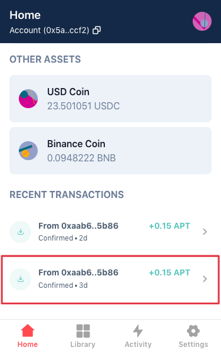
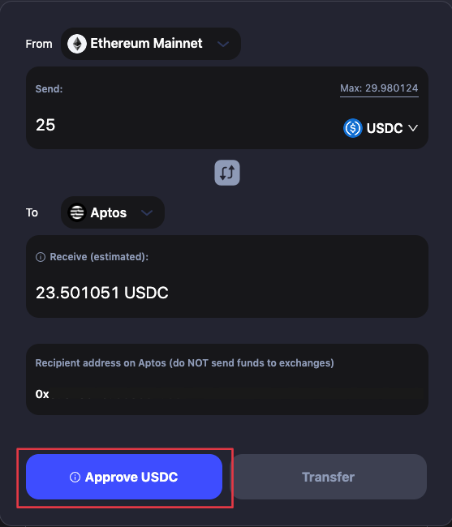

# Aptos Bridging Guide

We’ll use the BNB Chain, the $BNB token, and the MetaMask and Petra Wallets in this tutorial as an example.

## Connect Your Wallet

Before you start transferring assets via cBridge, you need to connect wallet first.

1\. Click "Connect Wallet", and you will be prompted to select a wallet. (cBridge currently supports MetaMask, TokenPocket, Coinbase Wallet, WalletConnect, and Clover on desktop browsers).

<figcaption></figcaption>

2\. Select “MetaMask”.

.png>)

3\. Click "Connect your Aptos wallet to receive the funds", and you will be prompted to select a wallet. (cBridge currently supports Petra, Blocto, Martian, BitKeep, and Fewcha wallets for Aptos).

<figcaption></figcaption>

4\. Select “Petra” and you will be prompted with a confirmation on Petra. Click “Approve” and your wallet will be connected successfully.

.png>)

Now you can see your recipient address on Aptos.

## **Transfer Assets to Aptos**

Let’s say, you want to transfer 0.1 $BNB from BNB Chain to Aptos:

1\. Select "BNB Chain" as the "From" chain and "Aptos" as the "To" chain.

.png>)

2\. You may be prompted to switch your wallet to BNB Chain first. Enter the amount you want to bridge under "Send". You should see the estimated amount you will receive under "Receive (estimated)".

.png>)

**Note that there will be a difference between the amount you send and the amount you receive, which is determined by the bridge rate and fees. For the exact definition of each item in the transaction, check the tooltips next to each of the terms.**

.png>)

3\. Review your transfer details and click "Transfer". You will receive a popup to submit the transfer.

.png>)

4\. After clicking "Transfer":

4.1 If it is a newly created Aptos account with 0 $APT in it, you will also receive 0.15 $APTOS to pay the gas fee on Aptos. Click "Confirm Transfer" and you will be prompted with a confirmation on MetaMask.

.png>)

.png>)

4.2 If there is some $APT balance in the Aptos account and it is the first time to receive this token on Aptos, it is mandatory to Register the token in the Aptos wallet first before claiming/receiving in Step 7. Please refer to [this section](aptos-bridging-guide.md#register-token-in-aptos-wallet-if) to find out how to register token. **You only need to register once per token.**

4.3 If there is some $APT balance in the Aptos account and it is **NOT** the first time to receive this token on Aptos, you will see “Transfer” button only and after clicking "Confirm Transfer" you will be prompted with a confirmation on MetaMask. In this case you do not need to Register the token anymore and still receive 0.15 APTOS to pay the gas fee on Aptos.

5\. After "Confirm Transfer", your transaction will be submitted. Please wait a few minutes.

6\. The page will show you the real-time progress of the transaction.&#x20;

.png>)

7\. When block confirmations and SGN confirmations are completed, you will see a popup to “Claim BNB”.

Note: You need to claim first to receive the token on Aptos. **You only need to claim once per token.**

.png>)

If you close this window without claiming $BNB, you can also Claim in cBridge History section.

<figcaption></figcaption>

<figcaption></figcaption>

8\. Click “Approve” and you will see the Transfer Completed popup.

.png>)

.png>)

9\. Click “Petra” at the extension in the top right corner of the browser, you can see all the assets in your wallet, including $APT and the bridged assets.

10\. You can also click “Recent Transactions” to view your transaction history and details.

## Register Token in Aptos Wallet (If Need)

If you transfer a token to Aptos for the first time, you will need to Register the token in your Aptos wallet first. Here take $USDC as the example and go through the steps as follows:

You will see “Register $USDC in your Aptos wallet” button first.

Then click “Approve” on Petra.

Then click “Approve USDC”, and you will be prompted to confirm on Metamask.

.png>)

Click “Confirm” and you will complete the token registration and can continue transferring your assets.

.png>)
