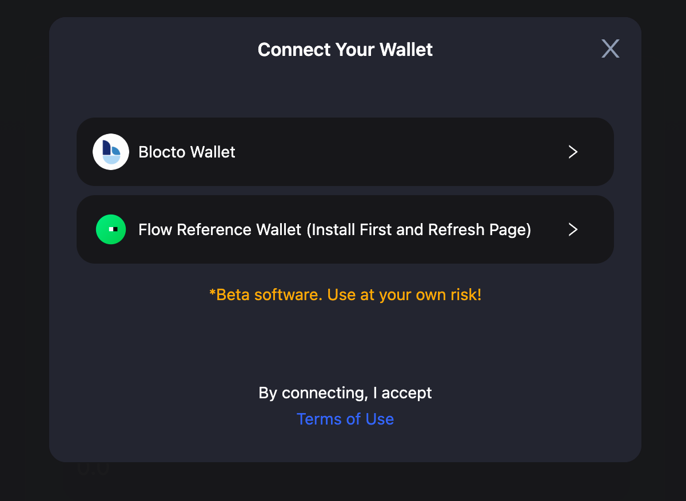

# Flow Cadence Bridging Guide

## Connect Your Wallet

Before you start transferring assets via cBridge, you will need to connect your wallet first.

1\. Click "Connect Wallet", and you will be prompted to select a wallet. (cBridge now supports MetaMask, TokenPocket, Coinbase Wallet, WalletConnect, and Clover on desktop browsers).

<figcaption></figcaption>

2\. Select “MetaMask”.

<figcaption></figcaption>

3. Click "Connect your Flow wallet to receive the funds", and you will be prompted to select a wallet. (cBridge now supports Blocto and Flow Reference wallets for Flow Cadence).

<figcaption></figcaption>

<figcaption></figcaption>

4. &#x20;Connect a wallet you would like to use for transfer.

&#x20;   4.1 _**Connect Blocto Wallet**_. By entering your email address, you can Sign in/ Register to your Blocto Account. After entering passcode given by Blocto, you can click confirm button to connect your Blocto wallet to cBridge.

<figcaption></figcaption>

<figcaption></figcaption>

<figcaption></figcaption>

<figcaption></figcaption>

<figcaption></figcaption>

&#x20;   4.2 _**Connect Flow Reference Wallet**_. cBridge website will detect whether you have installed Flow Reference Wallet. If not, you will need to install the chrome extension firstly according to the guideline and **Refresh cBridge website.** If Flow Reference Wallet has been installed in chrome,  you will see a prompt after selecting Flow Reference Wallet. By clicking **Connect** button, your Flow reference wallet is connected for cBridge transfer.

<figcaption></figcaption>

<figcaption></figcaption>

<figcaption></figcaption>

## Transfer Assets Across Chains

Let’s say, you want to transfer 11 BUSD from BNB Chain to Flow Cadence. The steps are made simple in cBridge:

1. Select "BNB Chain" in the dropbox next to "From" and "Flow Cadence" in the dropbox next to "To".

<figcaption></figcaption>

2. You will be prompted to switch your wallet to BNB Chain if it's not yet connected. Enter the amount you want to send under "Send". You should see the estimated amount you will receive under "Receive (estimated)".

<figcaption></figcaption>

Note that there will be a difference between the amount you send and the amount you receive, which is determined by the bridge rate and fees. For the exact definition of each item in the transaction, check the tooltips next to each of the terms.

<figcaption></figcaption>

3. Note that If you transfer BUSD to Flow Cadence **for the first time**, you will be prompted to “Create BUSD vault in your Follow wallet” first.

<figcaption></figcaption>

4. Then click “Approve” on Flow Wallet.

<figcaption></figcaption>

5. Then you need to “Approve BUSD”, and will be prompted to confirm on Metamask.

<figcaption></figcaption>

<figcaption></figcaption>

<figcaption></figcaption>

6. Click “Next” and "Approve" in each prompt and you can transfer your assets. Then, review your transfer details and click "Transfer". You will receive a popup to confirm the transfer.

<figcaption></figcaption>

Note if you have approved BUSD before, you will skip step 5 and see the below Transfer page.

<figcaption></figcaption>

7. Make a final review and click Confirm Transfer button. Then you will be prompted with a confirmation on MetaMask.

<figcaption></figcaption>

<figcaption></figcaption>

8. Click "Confirm", and your transaction will be submitted. Please wait for a few minutes as the bridging is in progress.

<figcaption></figcaption>

9. You can check transaction status by clicking History button.&#x20;

<figcaption></figcaption>

10. Here are examples of transaction statuses. When it shows **Completed**, it means the transaction is done and the token should be received on Flow Cadence.

<figcaption></figcaption>

<figcaption></figcaption>

10. You can also check token in your wallet.

<figcaption></figcaption>
