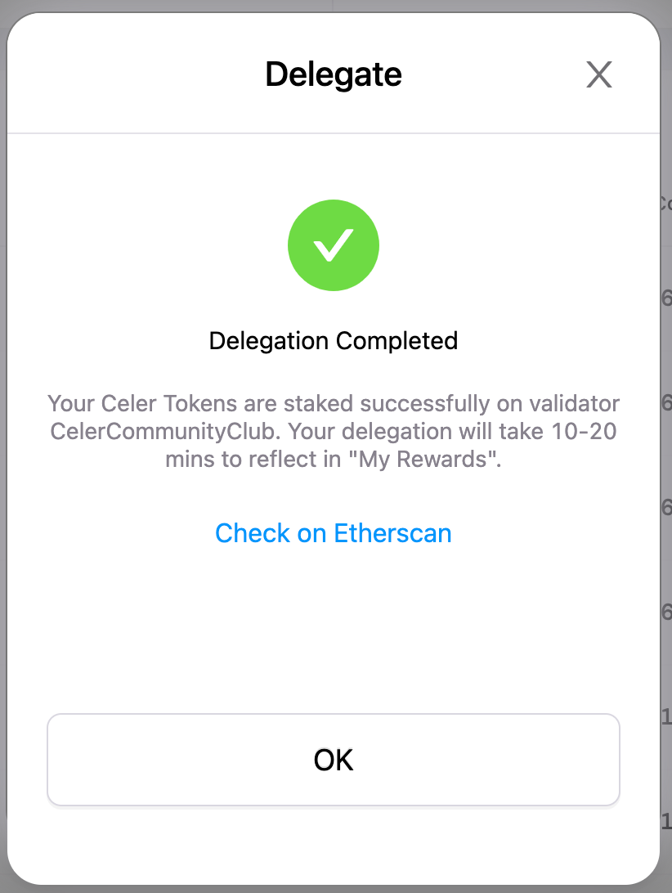
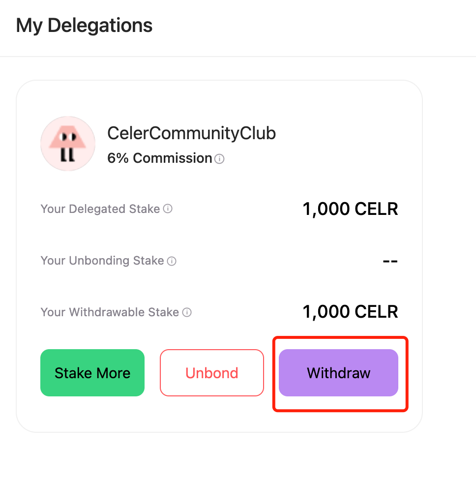

# SGN V2 Staking Guide

Staking your CELR with the Celer SGN allows you to gain transaction fee earnings and staking rewards. In this part, we will guide you through the process of delegating stakes to validators, withdrawing your stakes from the SGN, and managing your SGN rewards.&#x20;

## Delegate Stakes to Validators

1. First, connect your wallet to the Celer SGN and then switch to Ethereum Mainnet.

.png>)

2\. Click the "Delegate" button to choose a validator of your interest to delegate your CELR stakes to.

.png>)

3\. Enter the amount of CELR you want to stake and click "Give permission to stake your CELR". You will be prompted to confirm the transaction on MetaMask and click “Confirm”.

4\. After granting permission, click "Delegate" to approve.

.png>)

5\. You will then receive a "Delegation Completed" popup. Congratulations, you have completed the staking. Note that it may take some time for your staking rewards to show in "My Rewards".

6.You can check the delegation details by clicking the expand button next to "Details".

.png>)

## Manage SGN Rewards

On the "My Rewards" page, you will see two benefits that come with staking: Staking Rewards and cBridge Transaction Fee Earnings.

### Claim Staking Rewards

1. You need to first unlock your staking rewards to claim them. Click “Unlock to claim.”

.png>)

2\. You will see a popup showing the unlocking progress.

3\. Once rewards are unlocked, you will see a popup update asking if you want to claim rewards at the moment. Click "Claim" will prompt you to confirm the transaction on MetaMask.

4\. Or you can click “claim” in "My Rewards" later and claim your rewards after confirmation by MetaMask.

5\. Click the "Claim" button, and a confirmation popup will show up. Click "Claim" on the popup. You will be prompted to confirm the transaction on MetaMask. Confirm in Metamask.

6\. You can view status updates on SGN. It takes a few minutes for the transaction to complete on Ethereum, and you can always go to Etherscan to check the status of the transaction.

### Claim Transaction Fees from cBridge

When you stake CELR on SGN, in addition to staking rewards, you can also get cross-chain transaction fee earnings from cBridge.

Celer cBridge cross-chain transaction fee earnings come from three sources, the Celer Inter-chain Messaging framework, the open canonical token bridge standard and the pool-based bridge model.

.png>)

1\. To claim your transaction fee earnings, go to the “My Rewards” page, click “Claim Fee Rewards pool-based bridge” next to “cBridge Transaction Fee”, and a popup will appear to show you the rewards you can claim on different chains.

2.To claim fee rewards on a single chain, click "Claim" next to a single chain.

## Withdraw Your Stakes From SGN

To withdraw your stakes, you need to first unbond your stakes from the delegator, and wait for a 7-day unbonding process. Once stakes are unbonded, they can be withdrawn.

### Unbond Your Stakes

1. To unbond your stakes from a validator, go to "My Rewards" -> "My Delegations", and click the "unbond" button.

.png>)

Alternatively, you can go to "All Validators", and expand on the validator to find the "unbond" button.

.png>)

2\. On the popup that shows up, enter the amount you want to withdraw. You will be prompted to confirm the transaction on MetaMask. Click "Confirm".

.png>)

3\. After confirming, you will then receive an "Unbond in Progress" popup, which tells you when your stakes will become withdrawable.

.png>)

4\. Now you can see the amount of the stake being released in My Delegations.

5\. The unbonding process takes 7 days, after which your stakes will be moved to "Your Withdrawable Stakes".

### Withdraw Your Stakes

1. Click "Withdraw". &#x20;

2\. You will be prompted to confirm the transaction on MetaMask. Click "Confirm".

3\. It may take a few minutes for the transaction to complete. Once completed, you can check in Metamask if you have received the fund.

